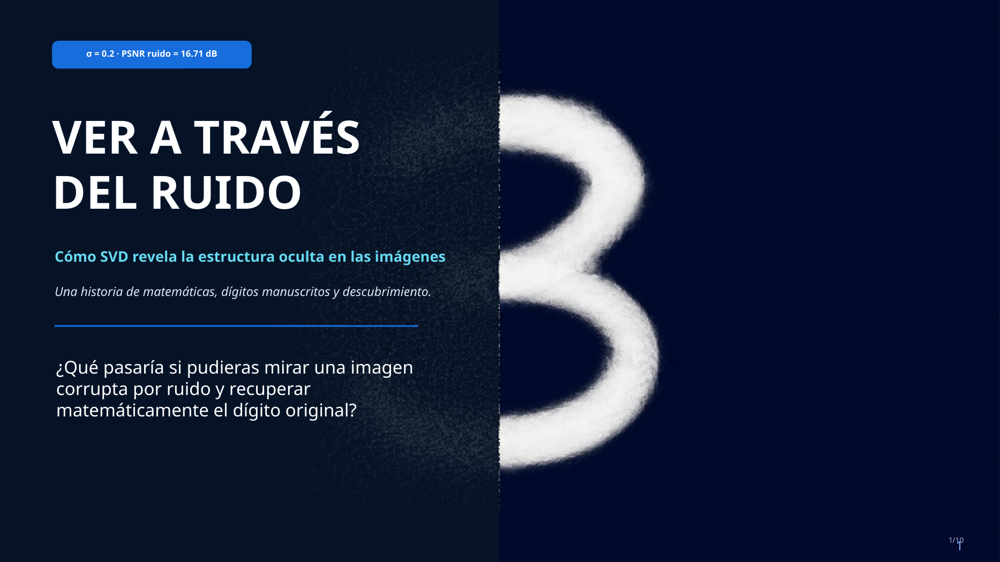
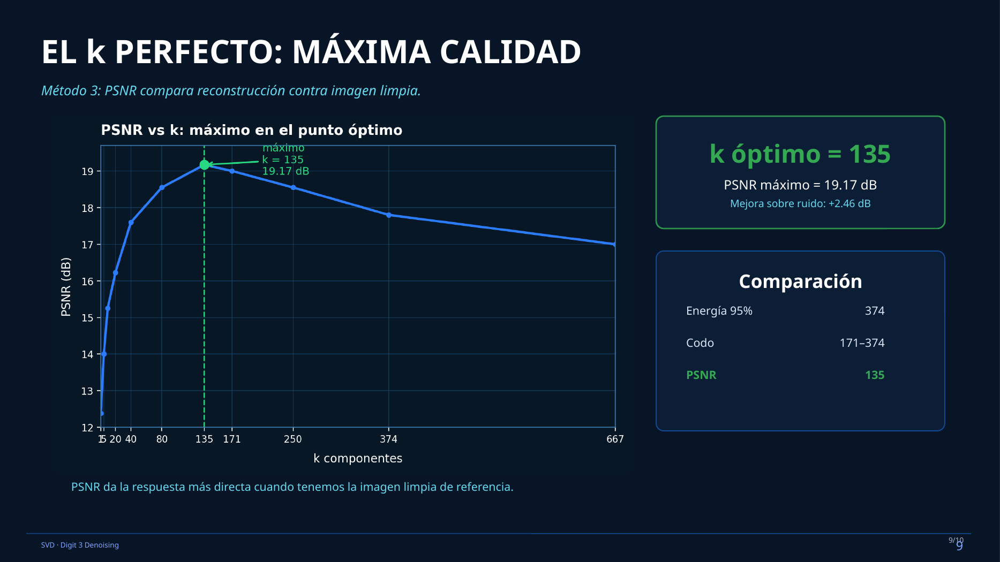
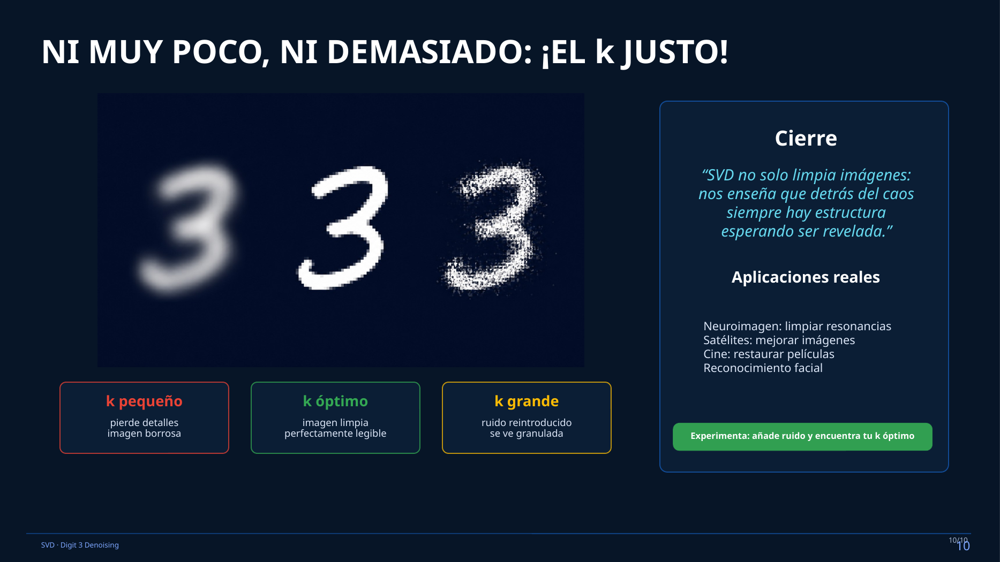

# Seeing Through the Noise: SVD Denoising of MNIST Digit 3



[](https://www.python.org/)
[](https://jupyter.org/)
[](LICENSE)

## Overview

This project demonstrates how **Singular Value Decomposition (SVD)** can recover shared structure from noisy handwritten images. Using thousands of examples of the handwritten digit **3** from the MNIST dataset, the notebook builds a matrix in which each image is represented as a 784-dimensional vector, adds Gaussian noise, decomposes the noisy matrix with SVD, and reconstructs the images using only the first `k` singular components.

The central question is simple:

> **How many SVD components should we keep to recover the digit while suppressing noise?**

The project explores that question using singular-value structure, cumulative energy, and **Peak Signal-to-Noise Ratio (PSNR)**.

## Project Highlights

- **6,131** handwritten digit-3 images
- **28 × 28 = 784** pixels per image
- Gaussian noise with **σ = 0.2**
- Full SVD of the noisy data matrix
- Rank-`k` reconstruction using truncated SVD
- Three perspectives for choosing `k`:
  - scree / singular-value inspection
  - cumulative energy
  - PSNR against the clean reference images
- Visual comparison of underfitting, useful denoising, and noise reintroduction
- Jupyter notebook plus presentation-ready slide deck

## Key Result

For the saved notebook run, the noisy images have a baseline PSNR of **16.71 dB**. The PSNR sweep reaches its maximum at:

| Metric | Result |
|---|---:|
| Noisy baseline PSNR | 16.71 dB |
| Optimal `k` by PSNR | **135** |
| Maximum PSNR | **19.17 dB** |
| Improvement over noisy input | **+2.46 dB** |
| Energy captured at `k = 135` | **88.7%** |
| Components retained | **135 / 784 = 17.2%** |

The cumulative-energy thresholds in the same run are:

| Energy retained | `k` |
|---|---:|
| 90% | 171 |
| 95% | 374 |
| 99% | 667 |



## Why SVD Works Here

Let the noisy data matrix be

\[
X \in \mathbb{R}^{N \times 784},
\]

where each row is one flattened 28 × 28 digit image. SVD decomposes the matrix as

\[
X = U\Sigma V^T.
\]

A rank-`k` approximation keeps only the first `k` singular components:

\[
X_k = U_k\Sigma_kV_k^T.
\]

The largest singular values capture the strongest shared patterns across the collection of handwritten 3s. Smaller components increasingly represent fine variation and noise. Choosing `k` is therefore a tradeoff:

- **Too small:** important digit structure is lost and the reconstruction becomes blurry.
- **Useful intermediate range:** dominant shared structure is retained while part of the noise is suppressed.
- **Too large:** additional components begin to reconstruct more of the noise.



## Methodology

The notebook follows this workflow:

1. Load MNIST and select all digit-3 images.
2. Flatten each 28 × 28 image into a vector of 784 pixels.
3. Normalize pixel intensities to `[0, 1]`.
4. Add zero-mean Gaussian noise with `σ = 0.2`.
5. Compute SVD on the full noisy digit-3 matrix.
6. Reconstruct the matrix for different values of `k`.
7. Measure reconstruction quality with Mean Squared Error (MSE) and PSNR.
8. Compare scree behavior, cumulative energy, and a PSNR sweep.
9. Visualize the effect of choosing `k` too small, near the best reconstruction, and too large.

## Repository Structure

```text
svd-digit-denoising/
├── README.md
├── SVD_Digit3_Denoising.ipynb
├── requirements.txt
├── .gitignore
├── LICENSE
├── CITATION.cff
├── assets/
│   ├── cover.png
│   ├── optimal_k.png
│   └── goldilocks.png
└── presentation/
    ├── SVD_Digit3_Denoising_10_slides_corregido.pptx
    └── SVD_Digit3_Denoising_10_slides_corregido.pdf
```

## Installation

Clone the repository and install the dependencies:

```bash
git clone <YOUR-REPOSITORY-URL>
cd svd-digit-denoising
python -m venv .venv
```

Activate the environment.

**Windows PowerShell**

```powershell
.venv\Scripts\Activate.ps1
```

**macOS / Linux**

```bash
source .venv/bin/activate
```

Install the packages:

```bash
pip install -r requirements.txt
```

Then launch Jupyter:

```bash
jupyter lab
```

Open `SVD_Digit3_Denoising.ipynb` and run the cells from top to bottom.

## Data

The notebook uses the **MNIST** handwritten-digit dataset. It first attempts to load MNIST through TensorFlow/Keras if TensorFlow is already available. Otherwise, it falls back to `sklearn.datasets.fetch_openml`.

The repository does **not** store the full MNIST dataset. It is downloaded by the notebook when needed.

## Reproducibility Note

The saved outputs shown in the notebook and presentation come from one completed run. Gaussian noise is generated randomly and the current notebook does not set a fixed random seed, so rerunning the notebook may produce slightly different singular values, PSNR measurements, and the exact best `k`.

For a fully deterministic experiment, set a NumPy random seed immediately before the noise-generation step.

## Interpretation

This project is primarily a demonstration of **low-rank approximation as a denoising tool**. It shows how a shared low-dimensional structure can emerge from a large collection of related images even when individual pixels are corrupted.

An important modeling lesson is that retaining more components is not always equivalent to producing a better denoised image. More components improve fidelity to the noisy matrix, but after a point they also begin to preserve unwanted noise. In this experiment, PSNR provides the most direct selection criterion because the clean reference images are available.

## Presentation

A 10-slide visual presentation is included in both PowerPoint and PDF format. It explains the intuition behind SVD, matrix dimensions, signal-versus-noise separation, cumulative energy, PSNR, and the effect of changing `k`.

The presentation is in **Spanish**, while the notebook and this README are in **English**.

## Skills Demonstrated

`Python` · `NumPy` · `Matplotlib` · `Jupyter` · `Linear Algebra` · `Singular Value Decomposition` · `Low-Rank Approximation` · `Image Denoising` · `MNIST` · `MSE` · `PSNR` · `Data Visualization`

## Author

**Alfredo Saldana Nunez**  
Data Science Project · 2026

## License

This repository is released under the [MIT License](LICENSE).
